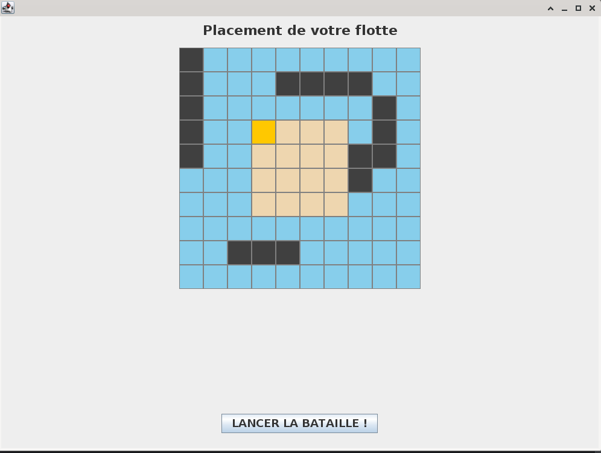
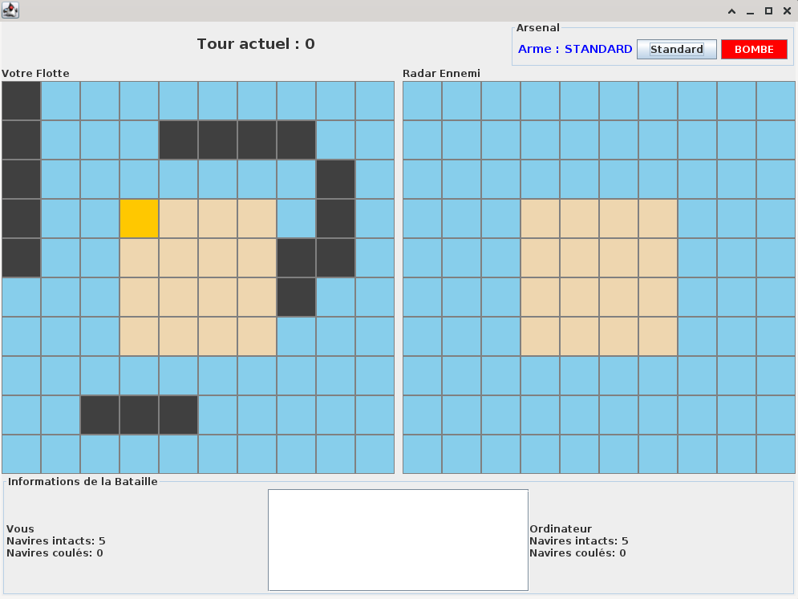
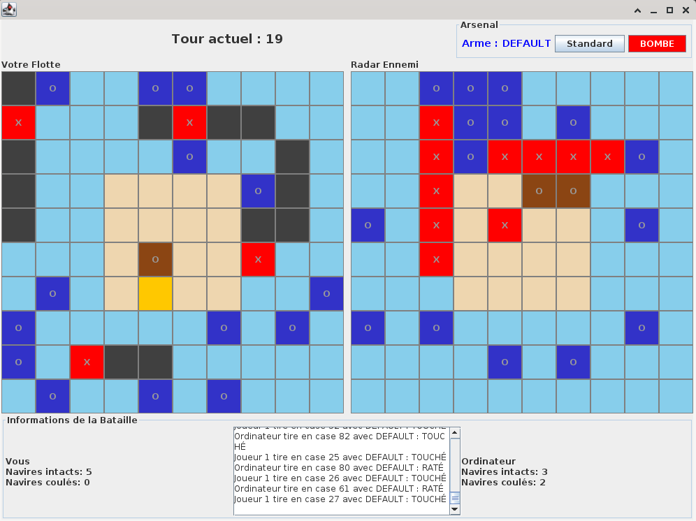

# Bataille Navale — Jeu Java / Swing (MVC & Design Patterns)

Bataille Navale est une application développée en **Java avec Java Swing**, réalisée dans le cadre d’un projet tutoré universitaire. Le projet implémente une version enrichie du jeu de bataille navale, intégrant des mécaniques avancées (armes, pièges, IA) et une **architecture logicielle orientée maintenabilité et extensibilité**.

L’application repose sur le **pattern MVC (Model–View–Controller)** afin de séparer clairement la logique métier, l’interface utilisateur et la gestion des interactions. De nombreux **patterns de conception** ont été utilisés pour faciliter l’évolution du jeu sans modifier le cœur du code.

---

## Technologies utilisées

- **Java 17**
- **Java Swing** — Interface graphique
- **Programmation Orientée Objet**
- **Git** — Gestion de version
- **JUnit** — Tests unitaires

---

## Architecture (MVC)

### Model
Le modèle contient toute la logique métier du jeu :
- Gestion de la **grille** (`Grid`, `Tile`)
- Hiérarchie des **objets plaçables** (bateaux, armes, pièges)
- Gestion des **joueurs** (Humain, IA)
- Calcul des statistiques et conditions de victoire  

La classe `Game` agit comme une **façade**, centralisant l’état du jeu, la gestion des tours et la détection de fin de partie.

### View
Les vues représentent les différentes interfaces utilisateur :
- Configuration de la partie
- Placement des objets
- Interface principale de jeu
- Écran de fin de partie  

Les vues observent le modèle via le **pattern Observer** afin de se mettre à jour automatiquement lors des changements d’état.

### Controller
Les contrôleurs traduisent les actions utilisateur (clics, choix) en actions sur le modèle :
- Contrôleurs dédiés au jeu, au placement et à la configuration
- Séparation entre **HumanController** et **AIController**
- Orchestration du déroulement des tours et des attaques

---

## Design Patterns utilisés

- **MVC** : séparation claire des responsabilités  
- **Factory** : création centralisée des bateaux, armes et pièges  
- **Observer** : mise à jour automatique des vues (grille, joueurs, tours)  
- **Strategy** : comportement d’attaque interchangeable pour les joueurs et l’IA  
- **Façade** : classe `Game` simplifiant l’interaction avec le modèle  
- **Callback** : gestion de la fin des attaques et du passage de tour sans couplage fort  

Ces choix permettent d’ajouter facilement de nouveaux types de bateaux, d’armes ou de comportements d’IA sans modifier l’architecture existante.

---

## Fonctionnalités

- Placement de bateaux, armes et pièges
- Combat au tour par tour
- IA avec stratégies d’attaque
- Gestion des effets spéciaux (armes, pièges)
- Interface graphique interactive (Swing)
- Historique des coups et statistiques
- Détection automatique de la victoire

---

## Aperçu du jeu

  &nbsp;
  &nbsp;
  

## Licence  
  
Projet sous licence MIT — voir le fichier LICENSE pour plus d’informations.

