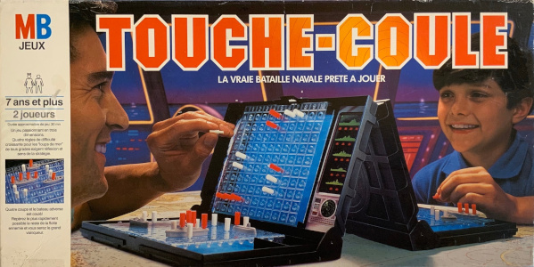
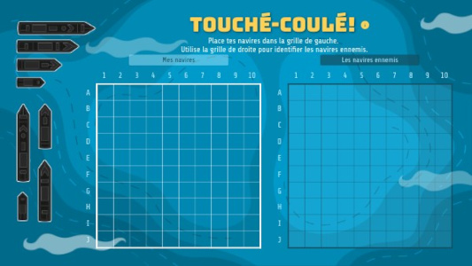

A31 - Projet "Bataille navale"
==============================

 

À vous de développer une application mono-joueur du jeu de société "Bataille navale" !

A - Consignes générales
-----------------------

### Pour démarrer avec le dépôt Git

1. **Créez un groupe `nom1-nom2`** où nom1 et nom2 sont les noms de famille des deux membres du binôme.
1. **Forkez** le dépôt <https://git.unistra.fr/a313/a31-bataille-navale> dans le groupe créé ci-dessus.
1. Ajoutez le responsable du module ET votre ou vos enseignant de TD/TP comme **Reporter** de votre dépôt

### Pour toute la durée du projet

- Ce projet est à réaliser **en binôme**.
- Les deux membres du binôme doivent apprtenir au **même groupe TP**.
- Vous devez concevoir avec UML et implémenter en Java le jeu de société "Bataille navale", en respectant une **architecture MVC** et en proposant une **interface graphique en Swing**.
- Vous devez respecter les **principes de conception** et mettre en œuvre les **patrons de conception** vus en cours, **lorsque cela est pertinent**. Attention, il ne s'agit pas d'essayer d'utiliser tous les patrons de conception vus en cours !
- Il est possible que vous soyez amenés à **renoncer à une partie du développement par manque de temps**. Dans ce cas, il faudra le signaler dans le rapport final (Exemple : "il aurait fallu faire *ceci* mais nous n’avions pas assez de temps et avons préféré nous concentrer sur *cela* parce que ...").
- Votre dépôt devra être **mis à jour au minimum une fois par semaine** de façon à ce que nous puissions évaluer votre progression sur toute la durée du projet.

B - Les règles du jeu
---------------------

Elles sont disponibles :

- en version textuelle :
  - version officielle du jeu de société : <Regles_officielles.pdf>,
  - version récente : <https://www.regles-du-jeu.fr/bataille-navale.html>.
)- en vidéo (ou pas) : <https://www.youtube.com/watch?v=6tcoaWil3QA>.

### Materiel

Le jeu de société comporte pour chaque joueur :

- **2 grilles de jeu de 10x10 cases**, une pour ses bateaux et une pour ceux de l'adversaire,
- **5 navires** à placer sur sa grille dont :
  - 1 porte-avion (5 cases)
  - 1 croiseur (4 cases)
  - 1 contre-torpilleur (3 cases)
  - 1 sous-marin (3 cases)
  - 1 torpilleur (2 cases)

C - Règles supplémentaires
--------------------------

Pour pimenter le jeu, nous proposons d'ajouter 2 armes, 2 pièges et 1 mode de jeu alternatif.

### C1 - Arme : La bombe

Elle touche la case ciblée (o) ainsi que les 4 cases à droite, à gauche, au-dessus et en-dessous (+).

```bash
-------------
|   | + |   |
-------------
| + | o | + |
-------------
|   | + |   |
-------------
```

Par défaut, chaque joueur possède une bombe à usage unique.

### C2 - Arme : Le sonar

Il permet de savoir combien de cases sont occupées par un bateau sur la case ciblée (o) et ses 8 cases voisines (+).

```bash
-------------
| + | + | + |
-------------
| + | o | + |
-------------
| + | + | + |
-------------
```

À noter :

- Il n'indique pas où sont les cases avec un bateau parmi ces 9 cases.
- Il ne peut pas être utilisé si le sous-marin est détruit (ou s'il n'y en a pas).

Par défaut, chaque joueur possède un sonar à usage unique.

### C3 - Piège : Le trou noir

Il se place comme un bateau. Lorsqu'un joueur touche un trou noir, l'attaque a en réalité lieu sur sa propre grille, aux même coordonnées.

À noter :

- le sonar considère que le trou noir est un bateau
- la bombe peut passer par le trou noir. Elle a alors l'effet de la bombe sur sa propre grille.

Par défaut, chaque joueur possède un trou noir à placer en début de partie, après ses bateaux.

### C4 - Piège : La tornade

Elle se place comme un bateau. Lorsque l'adversaire touche la tornade, ses 3 prochaines attaques auront leurs coordonnées modifiées, par exemple comme illustré ci-dessous :

```bash
    6   7   8   9  10   1   2   3   4   5
  -----------------------------------------
F |   |   |   |   |   |   |   |   |   |   |
  -----------------------------------------
G |   |   |   |   |   |   |   |   |   |   |
  -----------------------------------------
H |   |   |   |   |   |   |   |   |   |   |
  -----------------------------------------
I |   |   |   |   |   |   |   |   |   |   |
  -----------------------------------------
J |   |   |   |   |   |   |   |   |   |   |
  -----------------------------------------
A |   |   |   |   |   |   |   |   |   |   |
  -----------------------------------------
B |   |   |   |   |   |   |   |   |   |   |
  -----------------------------------------
C |   |   |   |   |   |   |   |   |   |   |
  -----------------------------------------
D |   |   |   |   |   |   |   |   |   |   |
  -----------------------------------------
E |   |   |   |   |   |   |   |   |   |   |
  -----------------------------------------
```

Note :

- il ne faut pas afficher les coordonnées modifiées sur l'interface car il ne faut pas qu'il sache où il va réellement tirer.
- le tir est consideré valide si la case initiale est valide, même si la nouvelle case de destination modifiée par la tornade a déjà été visée.
- l'adversaire doit être informé de la case qu'il touche réellement, c'est-à-dire avec les coordonnées classiques.

Par défaut, chaque joueur possède une tornade à placer en début de partie, après ses bateaux.

### C5 - Mode alternatif : L'île

L'île est une zone de la grille de taille 4x4 (X) sur laquelle vont être cachées les armes spéciales décrites ci-dessus. Chaque joueur a donc le choix d'attaquer des bateaux dans l'eau ou de fouiller l'île de l'adversaire pour trouver des armes.

```bash
    1   2   3   4   5   6   7   8   9  10
  -----------------------------------------
A |   |   |   |   |   |   |   |   |   |   |
  -----------------------------------------
B |   |   |   |   |   |   |   |   |   |   |
  -----------------------------------------
C |   |   |   |   |   |   |   |   |   |   |
  ------------=================------------
D |   |   |   ||X | X | X | X||   |   |   |
  -----------------------------------------
E |   |   |   ||X | X | X | X||   |   |   |
  -----------------------------------------
F |   |   |   ||X | X | X | X||   |   |   |
  -----------------------------------------
G |   |   |   ||X | X | X | X||   |   |   |
  ------------=================------------
H |   |   |   |   |   |   |   |   |   |   |
  -----------------------------------------
I |   |   |   |   |   |   |   |   |   |   |
  -----------------------------------------
J |   |   |   |   |   |   |   |   |   |   |
  -----------------------------------------
```

À noter :

- les bateaux ne peuvent pas être placés sur l'île
- on fouille l'île de la même manière que l'on lance un missile sur un bateau
- aucune des cases ciblées par la bombe ne doit se trouver sur l'île
- le sonar ne peut pas être utilisé sur l'île
- la tornade impacte aussi les fouilles sur l'île

Si le mode île est activé, les joueurs n'ont plus plus que le missile par défaut, ils n'ont ni arme supplémentaire ni piège.

D - Les fonctionnalités
-----------------------

Nous nous limiterons à **un seul joueur humain contre l'ordinateur**.
Dans ce cadre, vous devez modéliser et implémenter les fonctionalités ci-dessous.

### D1 - La génération de la grille

- Niveau 1 : taille fixe de 10x10
- Niveau 2 : taille paramétrable de 6x6 à 10x10

### D2 - Le choix du nombre de bateaux

- Niveau 1 : nombre fixe de 1 bateau de chaque type (comme dans les règles officielles)
- Niveau 2 : possibilité de choisir 1 à 3 bateaux de chaque type
  - maximum de 35 cases bateaux cumulées
  - nombre qui impacte les 2 joueurs

### D3 - Le placement des bateaux de l'ordinateur

- Niveau 1 : de façon fixe
- Niveau 2 : de façon aléatoire

### D4 - Le placement des bateaux du joueur humain

- Niveau 1 : de façon fixe
- Niveau 2 : de façon aléatoire
- Niveau 3 : de façon personnalisée avec choix d'orientation et de position

### D5 - Les tirs de l'ordinateur

- Niveau 1 : de façon aléatoire
- Niveau 2 : en cherchant à couler un bateau lorsqu'il le touche pour la première fois

### D6 - La détection de la fin de partie

Lorsqu'un joueur a coulé tous les bateaux adverses

### D7 - La possibilité de recommencer une partie après la fin d'une première partie

- Niveau 0 : pas de possibilité de recommencer
- Niveau 1 : possibilité de recommencer sans redémarrer l'application

### D8 - L'ajout des armes supplémentaires et pièges

Bombe, sonar, tornade et trou noir.

- Niveau 0 : aucune arme supplémentaire ni piège
- Niveau 1 : 1 arme ou 1 piège
- Niveau 2 : 1 arme et 1 piège
- Niveau 3 : 3 armes ou pièges
- Niveau 4 : Les 2 armes et les 2 pièges

### D9 - La sélection de l'arme à utiliser à son tour

Missile, bombe, sonar.

### D10 - Le placement des pièges en début de partie

- Niveau 1 : placés de façon fixe avant les bateaux
- Niveau 2 : placés de façon aléatoire après les bateaux
- Niveau 3 : placés manuellement par le joueur après les bateaux

### D11 - Le choix du mode île

- Niveau 1 : mode imposé, on joue forcément avec l'île
- Niveau 2 : mode au choix quand on configure la partie

### D12 - Le placement des armes et pièges sur l'île

- Niveau 1 : placement aléatoire
- Niveau 2 : placement manuel après le placement des bateaux

### D13 - La visualisation de l'historique de tous les coups joués

- Niveau 1 : visualisation dans la console
- Niveau 2 : visualisation dans l'interface graphique

> ***Fortement recommandé** : Faites une conception UML qui tient compte de tous les niveaux mais implémentez d'abord le jeu en entier avec tous les niveaux 1 avant d'implémenter les autres niveaux.*

E - L'interface graphique
-------------------------

Votre application doit proposer 4 écrans :

- un **écran de configuration** pour choisir les paramètres de la partie,
- un **écran de placement** pour choisir l'emplacement des bateaux et pièges du joueur humain,
- un **écran principal** qui permet de jouer une partie,
- un **écran de fin de partie**.

### E1 - Écran de configuration

Il doit permettre de choisir :

- la taille de la grille
- le nombre de bateaux de chaque type
- si le mode "Île" est activé

Un bouton doit permettre de passer à l'écran de placement.

### E2 - Écran de placement

Il doit proposer au joueur humain :

- un placement fixe intial (fonctionnalité [D4](#d4-le-placement-des-bateaux-du-joueur-humain))
- un bouton pour générer un nouveau placement aléatoire (si niveau 2 de la fonctionnalité [D4](#d4-le-placement-des-bateaux-du-joueur-humain))
- une façon ergonomique de placer ses différents bateaux (si niveau 3 de la fonctionnalité [D4](#d4-le-placement-des-bateaux-du-joueur-humain))

Un bouton doit permettre de démarrer la partie et passer à l'écran principal.

### E3 - Écran principal

L'écran principal doit afficher :

- les grille du joueur humain avec ses bateaux et la grille où le joueur humain va attaquer l'ordinateur
- le numéro du tour actuel (1 tour = 1 coup de chaque joueur)
- Pour chaque joueur :
  - le dernier coup qu'il a joué
  - le nombre de bateaux intacts, touchés et coulés
  - le nombre de tirs effectués dans l'eau
  - le nombre de cases de bateaux qu'il a touché / le nombre de cases de bateaux qu'il lui reste à toucher
  - la liste des armes et pièges qu'il a à sa disposition / qu'il a déjà utilisé
  - le nombre de cases de l'île qu'il lui reste à fouiller (si fonctionnalité [D11](#d11-le-choix-du-mode-île) implémentée)

**La grille doit permettre de visualiser** s'il s'agit d'une case :

- qui n'a pas encore été touchée
- touchée d'un bateau qui n'est pas coulé
- touchée d'un bateau qui est coulé
- où les deux armes supplémentaires et les pièges ont été utilisé (si fonctionnalité [D8](#d8-lajout-des-armes-supplémentaires-et-pièges) implémentée)
- de l'île non fouillée / fouillée mais vide / fouillée où il y avait une arme ou un piège (si fonctionnalité [D11](#d11-le-choix-du-mode-île) implémentée)

À son tour, **le joueur humain doit pouvoir réaliser les actions suivantes** :

- sélectionner l'arme à utiliser (si fonctionnalité [D8](#d8-lajout-des-armes-supplémentaires-et-pièges) implémentée)
- cliquer sur une case pour y utiliser l'arme sélectionnée ou pour fouiller l'île (si fonctionnalité [D11](#d11-le-choix-du-mode-île) implémentée)

Le **tour de l'ordinateur** doit être visualisé de façon ergonomique : le joueur humain doit se rendre compte que l'ordinateur a joué et comprendre quelle action il a effectué.

### E4 - Écran de fin de partie

Si la fin de partie est détectée, cet écran doit s'afficher. Il doit :

- annonce le vainqueur
- résumer les statistiques de la partie
- proposer de recommencer la partie (si fonctionnalité [D7](#d7-la-possibilité-de-recommencer-une-partie-après-la-fin-dune-première-partie))

Les rendus
----------

### 1er rendu

Date limite : le dimanche **23/11 à 23h59**

Documents :

- le **diagramme de classes** UML
  - le package `model` doit être décrit en anticipant tout le développement
  - les packages `controller` et `view` doivent proposer une version de base avec les classes minimales mais peuvent être incomplets
- le **code source**
- un **rapport** pour expliquer vos choix de conception

Le rendu est à faire sur votre dépôt Git **sur une branche nommée `rendu1`**.

### 2ème rendu

Date limite : le dimanche **21/12 à 23h59**

Documents :

- le **diagramme de classes** UML qui doit :
  - représenter l'intégralité de votre application
  - être entièrement cohérent avec le code
- le **code source**
- un **mode d'emploi** nommé `INSTALL.md` à la racine de votre projet, qui explique comment compiler, installer et lancer votre application
- un **rapport** pour présenter vos nouveaux choix de conception depuis le 1er rendu et expliquer les raisons des évolutions des choix de conception qui avaient été annoncés au 1er rendu.

Le rendu est à faire sur votre dépôt Git **sur une branche nommé `rendu2`**.

### Précisions

- Vos diagrammes UML doivent être au format PlantUML,
- À la fin du projet, votre dépôt devra contenir au minimum une branche `rendu1` et une branche `rendu2`. Ce seront les seules branches évaluées. Vous êtes libre de gérer le reste de votre dépôt comme vous le souhaitez.
